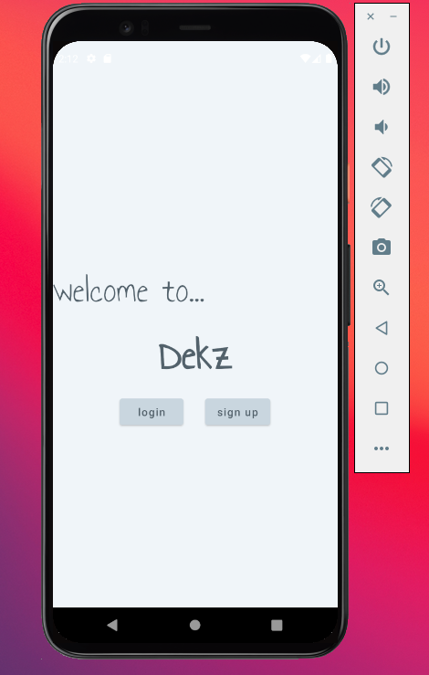
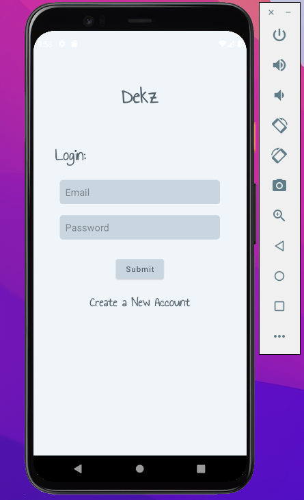
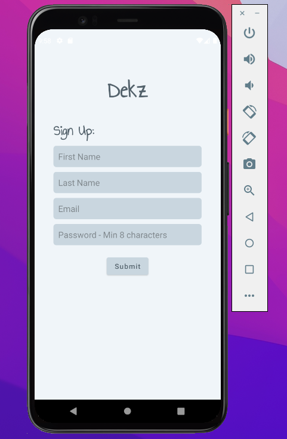
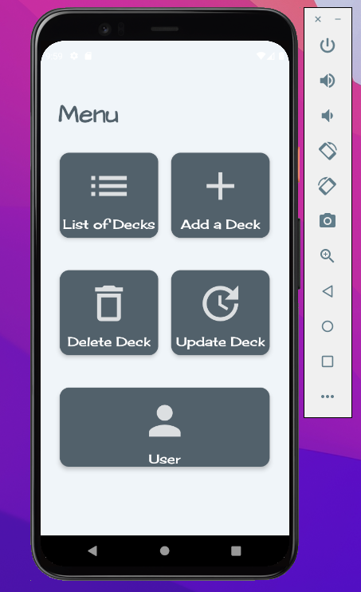
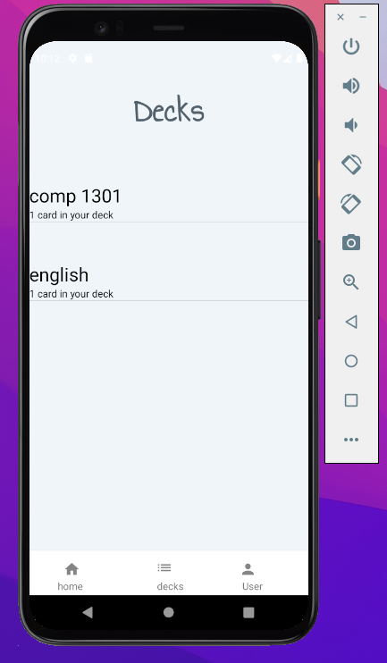
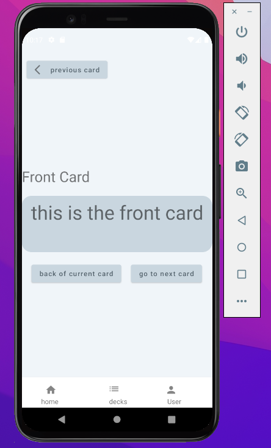
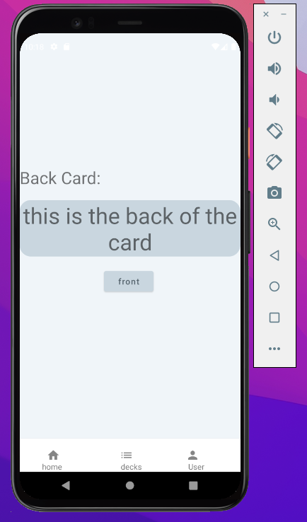
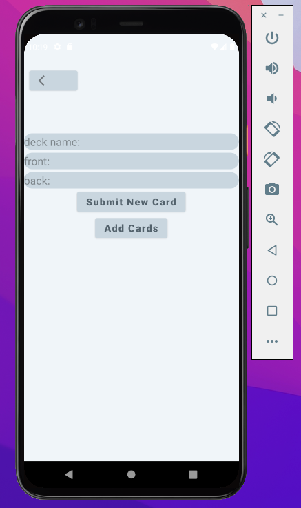
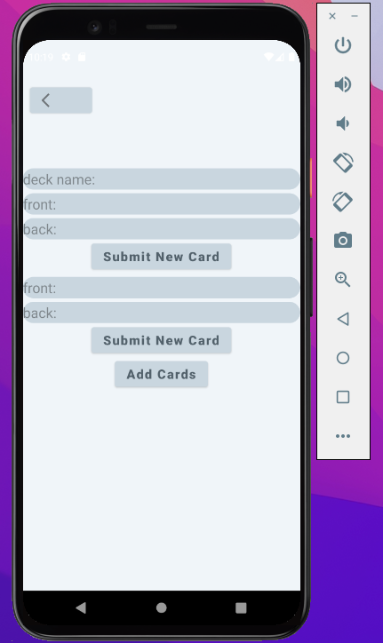

# deck_app

A flashcard android app that allows users to create flashcards to help with memorization. This app promotes active recall as studies suggest that this method improves memorization skill. User must sign up and create an account with Dekz to start creating flashcards. 

This app primarily uses Firebase API to authenticate users and create, read, update, and delete flashcards using Realtime Database from Firebase. 

Note: The focus of this project was to be able to work with an API and to gain further knowledge in using it.

 

 

  

